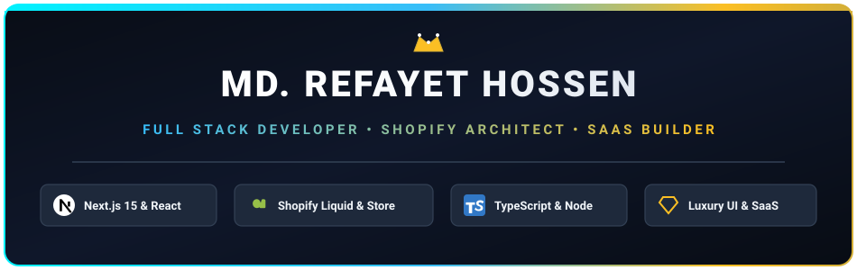
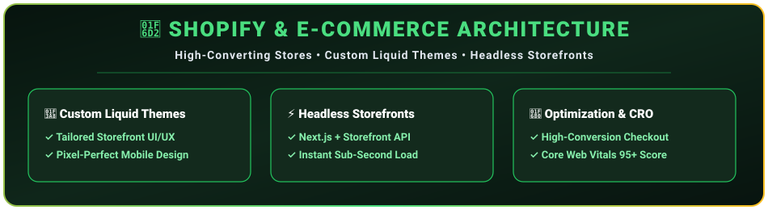
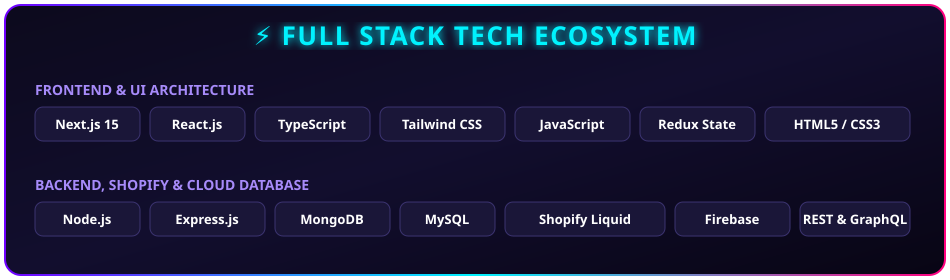

<div align="center">

  <!-- Local Crisp Animated Header SVG -->
  <a href="https://rifat-portfolio-brown.vercel.app/">
    
  </a>

  <br /><br />

  <!-- Action Badges & Direct Links -->
  <p align="center">
    <a href="https://rifat-portfolio-brown.vercel.app/" target="_blank">
      
    </a>
    <a href="https://www.linkedin.com/in/md-refayet-hossen-62b796236/" target="_blank">
      
    </a>
    <a href="mailto:mdrifayethossen@gmail.com">
      
    </a>
    <a href="https://github.com/rifat3790">
      
    </a>
  </p>

</div>

<hr />

## 👑 Executive Summary

```yaml
Name: Md. Refayet Hossen
Role: Senior Full Stack Developer & Shopify E-Commerce Architect
Core Stack: Next.js 15, React, TypeScript, Node.js, Express, MongoDB, MySQL, Shopify Liquid
Services: Custom Liquid Theme Engineering, Headless Commerce, SaaS Web Apps
Live Portfolio: https://rifat-portfolio-brown.vercel.app/
Contact Email: mdrifayethossen@gmail.com
Status: 🚀 Available for High-Ticket E-Commerce, SaaS & Architect Roles
```

> **"Pioneering digital excellence through high-performance code and luxury design systems."**
> I specialize in building custom, high-converting **Shopify storefronts**, **Headless E-Commerce applications**, and **scalable Next.js/React full-stack web applications**. From custom Liquid theme engineering to enterprise-grade web applications, I transform client vision into sleek, revenue-generating digital products.

<br />

---

## 🛒 Shopify & E-Commerce Architecture

<div align="center">
  
</div>

<br />

### 🌟 E-Commerce Core Capabilities:
- 🎨 **Custom Liquid Theme Engineering**: Pixel-perfect, bespoke Liquid templates tailored for luxury & high-ticket brands.
- ⚡ **Headless Shopify Commerce**: Combining **Next.js 15** with Shopify Storefront GraphQL API for instant sub-second page loads.
- 🛠️ **Custom Checkout & App Integration**: Private app integrations, subscription workflows, and custom payment gateways.
- 📈 **Performance & Speed Tuning**: Optimizing Core Web Vitals to achieve 95+ performance scores and boost conversion rates.

<br />

---

## 💎 Custom Headless Storefront Preview

<div align="center">
  
</div>

<br />

---

## ⚡ Full Stack Tech Ecosystem

<div align="center">
  
</div>

<br />

---

## 💎 Core Specializations & Services

<table>
  <tr>
    <td width="50%" valign="top">
      <h3 align="center">⚡ Full-Stack Web Development</h3>
      <p>Building high-speed web platforms leveraging <b>Next.js App Router</b>, Server Actions, TypeScript, Node.js, and MongoDB/MySQL database backends.</p>
    </td>
    <td width="50%" valign="top">
      <h3 align="center">🛒 Shopify Store & Theme Engineering</h3>
      <p>Creating luxury online storefronts, custom Liquid sections, high-converting product pages, and headless e-commerce architectures.</p>
    </td>
  </tr>
  <tr>
    <td width="50%" valign="top">
      <h3 align="center">🎨 Luxury UI/UX Design</h3>
      <p>Designing dark-mode-first glassmorphic web interfaces with smooth animations, high visual contrast, and intuitive user experiences.</p>
    </td>
    <td width="50%" valign="top">
      <h3 align="center">🔌 API Microservices & SaaS</h3>
      <p>Architecting secure RESTful & GraphQL APIs, custom authentication flows, webhooks, payment gateway pipelines, and SaaS backends.</p>
    </td>
  </tr>
</table>

<br />

---

## 📬 Let's Collaborate

<div align="center">

  <p align="center">
    <a href="https://rifat-portfolio-brown.vercel.app/" target="_blank">
      
    </a>
    <a href="https://www.linkedin.com/in/md-refayet-hossen-62b796236/" target="_blank">
      
    </a>
    <a href="mailto:mdrifayethossen@gmail.com">
      
    </a>
  </p>

  <br />

  

</div>
